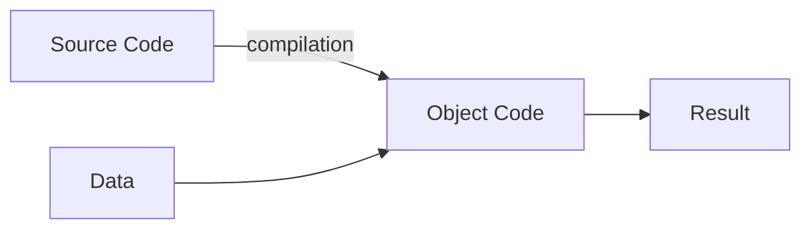
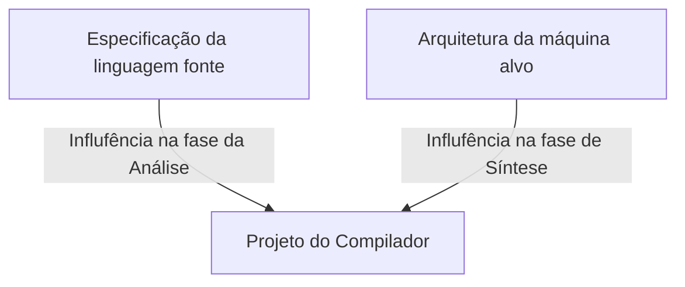
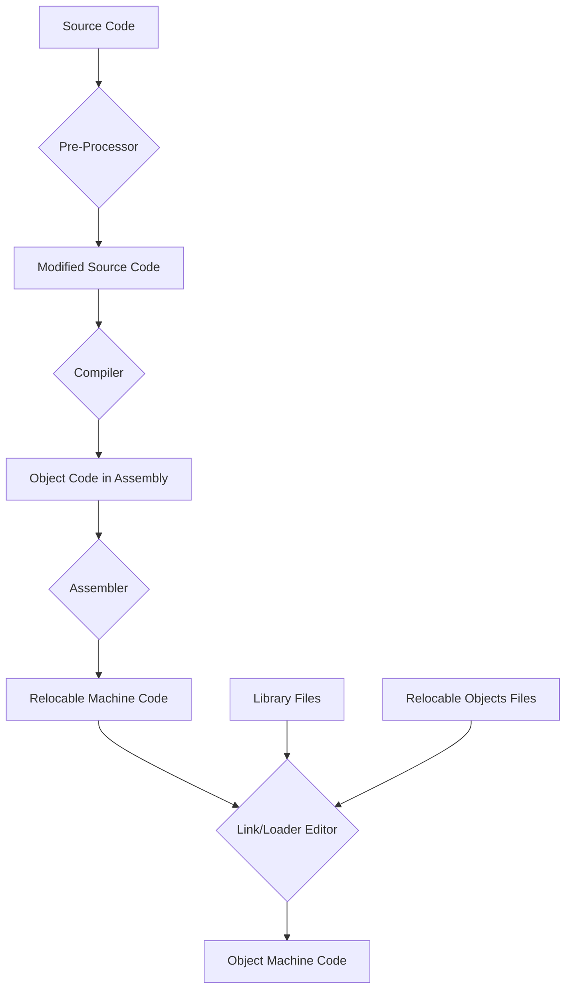
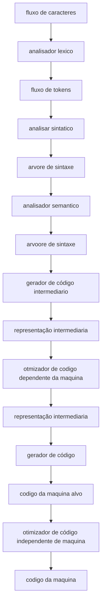

Concept of [[Computer Science]]

Reference: [[Compiler Construction principles and practice.pdf]]

Compilers is a program that compile a high level code to [[Machine Code]] for the CPU to understand

The challenge to solve is the high complexity on low level programming languages

# Topics

- ## [[Lexical Analysis]]
- ## [[Syntax Analysis]]
- ## [[Semantic Analysis]]

# Project

Intermediate Code Generator: code of three address of quadruples

# Notes

# Tarefa do Compilador

# Principais fatores que influenciam o projeto de um compilador

# Relações

- [[Interpreter]]
- [[Assembler]]
- [[Linker]]
- [[Loader]]
- [[Pre-processor]]
- [[Debugger]]
- [[Gerador de Perfil de Program]]

# Compiler Steps

# Compilador

# Macro

ANalise lexica: verfifica se a **palavra** esta bem formada
analise sintatica: verifica se a **senteção** está bem formada
analise semantica: verifica se o **texto** (analise de tipos) esta coerente

# Gerador de código intermediario

gera uma representação inermediaria linearizada, proxima do codigo de montagem que deve ser facilmente produziada e traduzida para a maquina alvo

uma representação intermadiraia muito utiliza é o **codigo de tres endereços**

exemplo: a[index] = 4 +2 -> t = 4 +2 (a[index] = t)

# Otimizador de código intermediário

Transforma o código intermediário com o objetivo de produzir um código objeto melhojr

Código objeto melhor pode significa: um código mais rápido, menor ou que consuma menos energia

exemplo:
t = 4 +2
a[index] = t

virar para
t = 6
a[index] = t

# Gerador de código alvo

A partir do código intermediário otimizado, gera o código para a máquina alvo
nessa fase as propriedades da máquina alvo se tornam o fator principal

- conjunto de instruções
- modoes de representação de dados
- omdos de endereçamento
- conjunto de registradores

# Otimizador de Código Alvo

![[Compiler 2024-10-14 20.01.49.excalidraw]]

arquivo fonte > analise
gramaticas > analise

analisa:
lexica
sintatica
semantica

# Difertnes visõe do processo de tradução

código fonte -> front end -> código intermediário -> back end -> código alvo

frontend: se preocupa em gerar o código intermediario
backend: se preocupa em gerar o código alvo a partir de um código intermediario
capacidade de troca

# Passadas

Repetir alguma etapa da compilação
