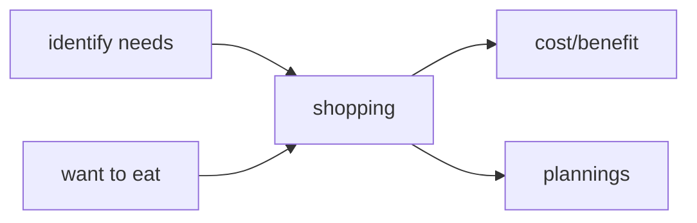

# Example

```mermaid
flowchart LR
1[identify needs] --> shopping --> cost/benefit
2[want to eat] --> shopping --> plannings
```

<iframe width="100%" height="700" src="https://medium.com/@ensleytan/how-mermaid-diagrams-work-in-obsidian-b7680fe00fa8"></iframe>