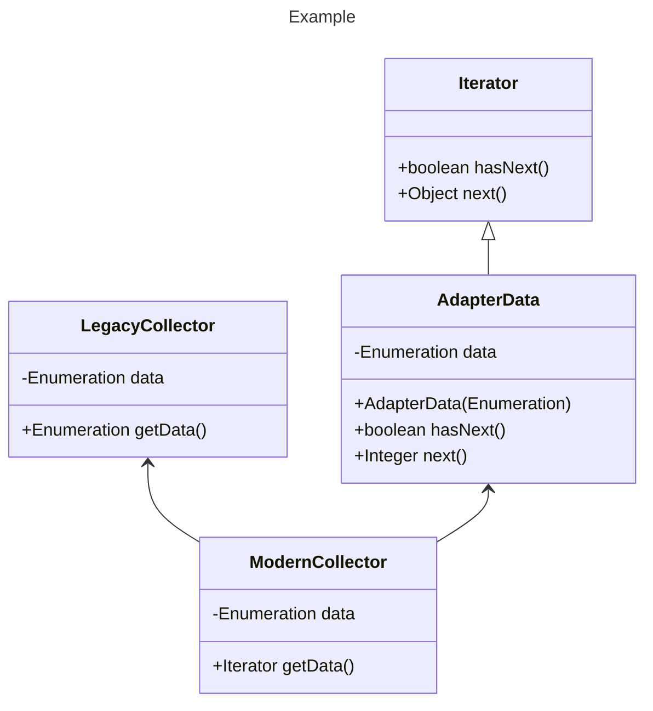

```mermaid
---
title: Example
---
classDiagram
    LegacyCollector <-- ModernCollector
    AdapterData <-- ModernCollector
    Iterator <|-- AdapterData
    class LegacyCollector{
        +Enumeration getData() 
        -Enumeration data
    }
    class ModernCollector{
        +Iterator getData() 
        -Enumeration data
    }
    class AdapterData{
        -Enumeration data
        +AdapterData(Enumeration)
        +boolean hasNext()
        +Integer next()
    }
	
	class Iterator{
        +boolean hasNext()
        +Object next()
    }
```