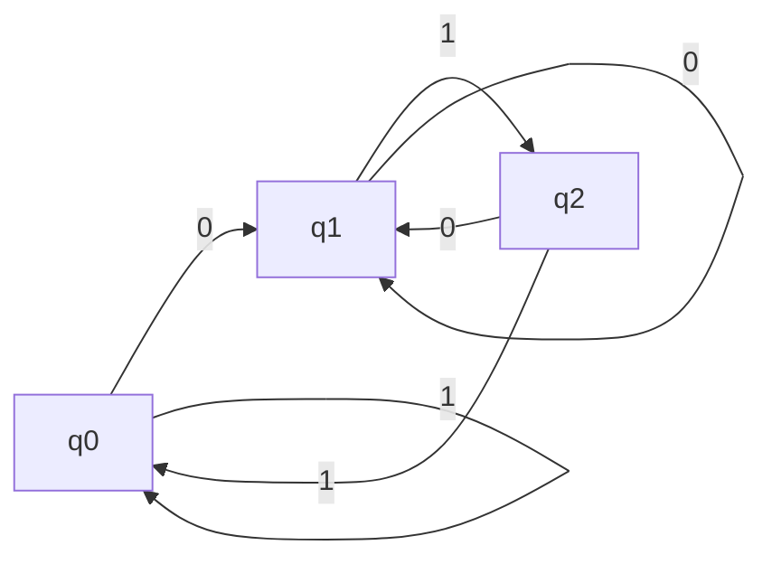

# Description
### The Automata Can Be Only One State

# Representation 

# $$ A = (Q,\sum,\delta, q_0, F)$$

## $Q$ - States
## $\sum$ : Sets of Data
## $\delta$ : Function to Change State over Data
## $q_0$ : Initial State
## $F$ : Final State

# Example

# $$L = \{w|w \text{ ends with 01}\}$$

